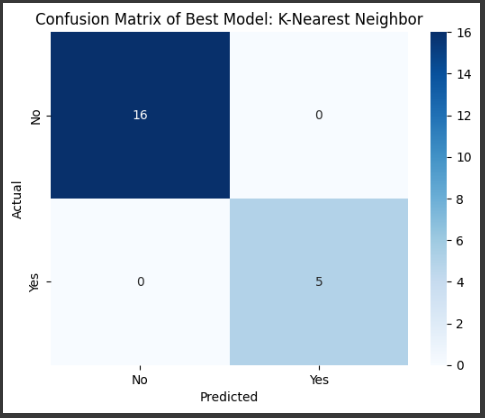

# Laporan Proyek Machine Learning - **Prediksi Anemia**

## **Project Overview**
Pada proyek ini, tujuan utama adalah membangun model machine learning untuk memprediksi kondisi anemia berdasarkan dataset yang berisi informasi seperti persentase piksel RGB, kadar hemoglobin (Hb), jenis kelamin, dan label anemia. Proyek ini bertujuan untuk mendukung identifikasi dini anemia secara efisien melalui analisis data berbasis fitur kuantitatif, sehingga dapat membantu mengurangi dampak anemia terhadap kesehatan global.

Pentingnya proyek ini terletak pada kemampuannya untuk memberikan prediksi cepat yang dapat digunakan dalam pengambilan keputusan di bidang medis. Berdasarkan estimasi Kassebaum et al. (2010), anemia menyumbang 68,4 juta tahun hidup dengan disabilitas (YLD) secara global, dengan prevalensi yang paling tinggi terjadi di wilayah sub-Sahara Afrika dan Asia Selatan. Dengan memanfaatkan pendekatan berbasis data ini, model yang dibangun diharapkan dapat menjadi alat pendukung dalam mendiagnosis anemia lebih cepat dan lebih akurat.

**Referensi**: [Link Referensi](https://ashpublications.org/blood/article/123/5/611/32812/Anemia-a-comprehensive-global-estimate)  

---

## **Business Understanding**

### **Problem Statements**
1. Bagaimana cara membuat model machine learning untuk memprediksi anemia dengan akurasi yang baik?  
2. Apa model machine learning terbaik yang dapat digunakan untuk kasus ini berdasarkan evaluasi?  
3. Bagaimana visualisasi data dapat membantu memahami pola anemia dalam dataset?  

### **Goals**
1. Mengembangkan model klasifikasi untuk memprediksi kondisi anemia berdasarkan dataset yang tersedia.  
2. Mengevaluasi performa berbagai model seperti K-Nearest Neighbor, Random Forest, dan AdaBoost untuk menentukan model terbaik.  
3. Memberikan wawasan berdasarkan visualisasi data untuk mendukung analisis prediktif.  

### **Solution Approach**
- **Solution 1**: K-Nearest Neighbor (KNN): Digunakan untuk klasifikasi berdasarkan kedekatan jarak data.  
- **Solution 2**: Random Forest: Model ensemble berbasis decision tree yang mengurangi overfitting.  
- **Solution 3**: AdaBoost: Algoritma boosting yang menggabungkan model lemah untuk meningkatkan akurasi prediksi.  

---

## **Data Understanding**

### **Dataset**
Dataset digunakan dari tautan Google Drive yang berisi 104 sampel data. Setiap baris data mencakup informasi seperti:  
- `Number`: Nomor sampel.  
- `Sex`: Jenis kelamin (Pria/Wanita).  
- `%Red Pixel`, `%Green pixel`, `%Blue pixel`: Proporsi piksel RGB dalam sampel gambar.  
- `Hb`: Kadar hemoglobin dalam darah.  
- `Anaemic`: Label target (Yes/No).  

**Link dataset**: [Download Dataset](https://drive.google.com/uc?id=1UcIf37Wi-ebSDr_ZMmRfxBE2ENflblV8)  

### **Visualisasi dan Insight**
- Distribusi fitur numerik menunjukkan nilai-nilai yang cenderung normal setelah dilakukan scaling.  
- Korelasi antar fitur numerik dianalisis menggunakan heatmap untuk mengidentifikasi hubungan antara persentase piksel dan kadar Hb.  
- Distribusi label target menunjukkan keseimbangan data untuk kelas `Anaemic`.  

---

## **Data Preparation**
1. **Encoding**: Kolom kategorikal (`Sex`, `Anaemic`) diubah menjadi bentuk numerik menggunakan Label Encoding.  
2. **Scaling**: Fitur numerik seperti `Hb` dan persentase piksel (`%Red Pixel`, `%Green pixel`, `%Blue pixel`) dinormalisasi menggunakan `StandardScaler`.  
3. **Splitting**: Dataset dibagi menjadi training (80%) dan testing (20%) dengan stratifikasi pada label `Anaemic`.  

---

## **Modeling**
Tiga algoritma digunakan dalam proyek ini:  
1. **K-Nearest Neighbor (KNN)**:  
   Model KNN dengan parameter default (`n_neighbors=5`) diterapkan pada data yang telah diproses.  

2. **Random Forest**:  
   Random Forest diterapkan dengan 100 pohon keputusan untuk meningkatkan stabilitas dan akurasi.  

3. **AdaBoost**:  
   Algoritma boosting ini menggunakan 50 estimator untuk memperbaiki kesalahan prediksi.  

---

## **Evaluation**
Metrik evaluasi yang digunakan untuk menilai performa model:  
- **Accuracy**: Proporsi prediksi benar dibanding total prediksi.  
- **Precision**: Kemampuan model untuk memprediksi kelas positif dengan benar.  
- **Recall**: Kemampuan model untuk menemukan semua sampel kelas positif.  
- **F1 Score**: Harmoni antara precision dan recall.  

### **Hasil Evaluasi**
| Model              | Accuracy | Precision | Recall | F1 Score |  
|--------------------|----------|-----------|--------|----------|  
| K-Nearest Neighbor | 100%     | 100%      | 100%   | 100%     |  
| Random Forest      | 100%     | 100%      | 100%   | 100%     |  
| AdaBoost           | 100%     | 100%      | 100%   | 100%     |  

**Model terbaik**: K-Nearest Neighbor dengan F1 Score sebesar **100%** berdasarkan pemilihan sistem.  

### **Visualisasi Confusion Matrix**  
Confusion matrix dari model terbaik (K-Nearest Neighbor) menunjukkan distribusi prediksi antara kelas `Anaemic` (Yes/No).  

---

## **Kesimpulan**
1. Model K-Nearest Neighbor menjadi pilihan terbaik untuk memprediksi kondisi anemia berdasarkan pemilihan sistem, tetapi ketiga model mendapatkan accuracy 100% semua.  
2. Dengan F1 Score sebesar 100%, model ini menunjukkan kinerja yang cukup baik dalam menangani data testing.  
3. Model dapat digunakan untuk membantu mendeteksi anemia pada dataset serupa, tetapi perlu diuji lebih lanjut pada dataset dengan ukuran yang lebih besar.  

--- 

## **Penggunaan Model**
- File model terbaik disimpan sebagai `best_model.pkl`.  
- Model dapat dimuat kembali menggunakan pustaka `joblib` untuk prediksi lebih lanjut.  

---
